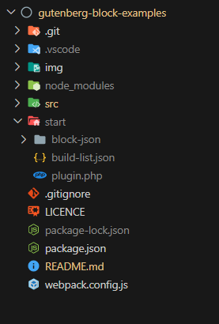

# Gutenberg Block Examples

This repository contains a series of examples to demonstrate various aspects of coding Gutenberg blocks.

There is an alphabetical list of the examples [below](#alphabetical-index-of-examples), as well as a [suggested order](#suggested-order).

## Using these examples

The example files, which are written in [JSX](https://react.dev/learn/writing-markup-with-jsx), are in the `src/` folder. When using the examples, they are transpiled into a WordPress plugin, located in the `start/`.

Running these examples on your computer requires a development environment, so that, a WordPress test site can be hosted locally.

### Development environment: WordPress' recommended way

Using these examples requires WordPress' development environment:

- Node.js--needed for everything else to run.

- [`@wordpress/env`](https://developer.wordpress.org/block-editor/reference-guides/packages/packages-env/)--needed to get a locally hosted test site running on you computer.

  - Requires Docker (installed separately)

- [`@wordpress/scripts`](https://developer.wordpress.org/block-editor/reference-guides/packages/packages-scripts/)--needed to build (transpile) the examples into a WordPress plugin.

  - Requires Webpack (installed automatically when `@wordpress/scripts` is installed)

WordPress' development environment quick start guide can be found in the [Gutenberg Handbook](https://developer.wordpress.org/block-editor/getting-started/devenv/#quick-start).

**When `wp-scripts` is started, the examples are built into a WP plugin, located in the `/start` folder.**

Using this environment, when files within the `src` folder are changed and saved, the plugin within the `start` folder will automatically be updated.

Other methods of running a WP test site can be use. However, the you must be able to copy the `start` folder to the `wp-content/plugins/` folder of a WP installation. Using code editors, such as VS Code, it is also possible to connect the `start` folder to a remotely hosted WP site via an FPT/SFTP plugin.

### Clone this repository and install the examples

Once the development environment is up and running, the examples can be installed .

[Clone this repository](https://docs.github.com/en/repositories/creating-and-managing-repositories/cloning-a-repository) into the folder you wish to work from on your computer@#[]. For example, `gutenberg-block-examples`.

In the terminal, from the examples' root folder, enter:

```
~/gutenberg-block-examples$ npm install
```

This will create a `node_modules` folder, and install all the npm dependencies listed in the `package.json` file.

### Building the test plugin

With a WP site running (terminal: `wp-env start`):

1. Open `src/build-list.json`.

2. On the examples you want to test, set `include` to `true`.

3. In the terminal, enter:

```
~/gutenberg-block-examples/$ npm run start
```

`wp-scripts` will now create the `start/` folder, and the plugin files will be placed into it. The chosen examples should now be available in the test site.



*The folder structure after build process has started.*  
*The plugin is in the `start` folder.*

**Each time you wish to change which examples are included in the plugin, you must stop `wp-scripts` (ctrl + c in the terminal where `wp-scripts` is running), edit `src/build-list.json`, and restart `wp-scripts`.**

## File naming

When working on multiple examples at once, it is confusing to have several files open in the code editor, all called `index.js` etc. To avoid this, in the `src` folder, most files are prefaced with the name of the example. When the examples are built to the `start` folder, all of the JS files are *transpiled* to `start/example-name/index.js`; the other files in the example are *copied* to `start/example-name/`, and in some cases renamed as well.

### The filename scheme for examples

**Example files**

- All JS files *transpiled* from `src/example-name/*.js`, to `start/example-name/index.js`

- `src/example-name/example-name.php` *copied* & *renamed* to `start/example-name/index.php`

- `src/example-name/example-name.block.json` *copied* & *renamed* to `start/example-name/block.json`

- `src/example-name/example-name.style.css` *copied* & *renamed* to `start/example-name/style.css`

- `src/example-name/example-name.style.scss` *transpiled* to `start/example-name/style.css`

- `src/example-name/extra-block.block.json` *copied* to `src/example-name/extra-block.block.json` †

† Some examples build more than one block. In which case, the primary block's JSON file becomes `block.json`, and the secondary block's JSON filename remains unchanged. Try the `block-json` example to see this in action.

**Plugin files**

- `scr/plugin.php` *copied* to `start/plugin,php`

- `src/build-list.json` *copied* to `src/build-list.json`††

††Note, `build-list.json` is needed for the serverside code, as well as the Webpack build process.

The build process also adds the following files to root folder of each example:

- `index.assets.php`--contains the WP `@wordpress` dependencies for the example. The dependencies are generated from the `import` statements of `@wordpress` packages in the example's JS source files. †††

- `style.css.map`--allows Devtools to quote filenames and line numbers in the source style code (`css`, or `scss`), rather than the transpiled code.

- `index.js.map`--allows Devtools to quote filenames and line numbers in the source JS code, rather than the transpiled code.

††† Note, normally Webpack will include the code for the dependencies into the transpiled file. However, Webpack can be instructed that certain packages will be available in the JS environment (in this case the Gutenberg editor, in a WordPress website), and don't need to be included. These packages are called "externals". `@wordpress/scripts` includes all `@wordpress` packages, and several other 3rd party packages as externals. See the documentation on [GitHub](https://github.com/WordPress/gutenberg/blob/trunk/packages/dependency-extraction-webpack-plugin/README.md#webpack) for more details.


*The `start` folder, after two examples have been built to it.*

**Links to files**

The PHP file uses the transpiled names, whereas, the `src` JS files uses the file names as they are before transpiling. This is because the PHP files are only used once the plugin is built, while the `src` JS files are transpiled to `index.js` by Webpack during the build process.

## Suggested order

[`richtext-basic`](./src/richtext-basic)

[`block-json`](./src/block-json)

[`richtext-supports`](./src/richtext-supports)

[`richtext-multi-components`](./src/richtext-multi-components)

[`richtext-multiline`](./src/richtext-multiline)

[`richtext-toolbar-buttons`](./src/richtext-toolbar-buttons)

[`richtext-text-align`](./src/richtext-text-align)

[`richtext-split-merge`](./src/richtext-split-merge)

[`richtext-transforms-simple`](./src/richtext-transforms-simple)

[`richtext-transforms-multiblock`](./src/richtext-transforms-multiblock)

[`filter-block-settings`](./src/filter-block-settings)

[`filter-core-block-controls`](./src/filter-core-block-controls)

[`filter-core-block-supports`](./src/filter-core-block-supports)

[`block-categories`](./src/block-categories)

[`block-collection`](./src/block-collection)

[`block-patterns`](./src/block-patterns)

[`block-styles`](./src/block-styles)

[`inner-blocks`](./src/inner-blocks)

[`inner-blocks-context`](./src/inner-blocks-context)

[`block-lock`](./src/block-lock)

[`templates`](./src/templates)

[`inner-blocks-template`](./src/inner-blocks-template)

[`variations-existing-blocks`](./src/variations-existing-blocks)

[`variations-query-block`](./src/variations-query-block)

[`variations-register-block`](./src/variations-register-block)

[`inspector-control-tabs`](./src/inspector-control-tabs)

[`dynamic-simple`](./src/dynamic-simple)

[`dynamic-inner-blocks`](./src/dynamic-inner-blocks)

[`dynamic-attribute`](./src/dynamic-attribute)

[`dynamic-serverside-render`](./src/dynamic-serverside-render)

[`dynamic-inspector-controls`](./src/dynamic-inspector-controls)

[`dynamic-inspector-query-terms`](./src/dynamic-inspector-query-terms)

[`render-php-template`](./src/render-php-template)

[`meta-simple`](./src/meta-simple)

[`meta-document-settings`](./src/meta-document-settings)

[`meta-plugin-sidebar`](./src/meta-plugin-sidebar)

[`meta-block-inspector`](./src/meta-block-inspector)

[`meta-callback`](./src/meta-callback)

[`meta-with-media`](./src/meta-with-media)

[`meta-notices-save-lock`](./src/meta-notices-save-lock)

[`meta-attribute`](./src/meta-attribute)

[`meta-with-select-doc-settings`](./src/meta-with-select-doc-settings)

## Alphabetical index of examples


[`block-categories`](./src/block-categories)

[`block-collection`](./src/block-collection)

[`block-json`](./src/block-json)

[`block-lock`](./src/block-lock)

[`block-patterns`](./src/block-patterns)

[`block-styles`](./src/block-styles)

[`dynamic-attribute`](./src/dynamic-attribute)

[`dynamic-inner-blocks`](./src/dynamic-inner-blocks)

[`dynamic-inspector-controls`](./src/dynamic-inspector-controls)

[`dynamic-inspector-query-terms`](./src/dynamic-inspector-query-terms)

[`dynamic-serverside-render`](./src/dynamic-serverside-render)

[`dynamic-simple`](./src/dynamic-simple)

[`filter-block-settings`](./src/filter-block-settings)

[`filter-core-block-controls`](./src/filter-core-block-controls)

[`filter-core-block-supports`](./src/filter-core-block-supports)

[`inner-blocks`](./src/inner-blocks)

[`inner-blocks-context`](./src/inner-blocks-context)

[`inner-blocks-template`](./src/inner-blocks-template)

[`inspector-control-tabs`](./src/inspector-control-tabs)

[`meta-attribute`](./src/meta-attribute)

[`meta-block-inspector`](./src/meta-block-inspector)

[`meta-callback`](./src/meta-callback)

[`meta-document-settings`](./src/meta-document-settings)

[`meta-notices-save-lock`](./src/meta-notices-save-lock)

[`meta-plugin-sidebar`](./src/meta-plugin-sidebar)

[`meta-simple`](./src/meta-simple)

[`meta-with-media`](./src/meta-with-media)

[`meta-with-select-doc-settings`](./src/meta-with-select-doc-settings)

[`render-php-template`](./src/render-php-template)

[`richtext-basic`](./src/richtext-basic)

[`richtext-multi-components`](./src/richtext-multi-components)

[`richtext-multiline`](./src/richtext-multiline)

[`richtext-split-merge`](./src/richtext-split-merge)

[`richtext-supports`](./src/richtext-supports)

[`richtext-text-align`](./src/richtext-text-align)

[`richtext-toolbar-buttons`](./src/richtext-toolbar-buttons)

[`richtext-transforms-multiblock`](./src/richtext-transforms-multiblock)

[`richtext-transforms-simple`](./src/richtext-transforms-simple)

[`templates`](./src/templates)

[`variations-existing-blocks`](./src/variations-existing-blocks)

[`variations-query-block`](./src/variations-query-block)

[`variations-register-block`](./src/variations-register-block)