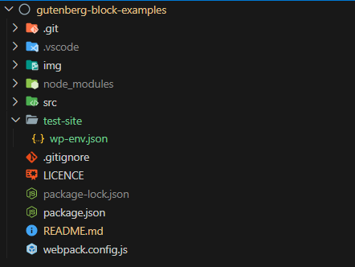

# Gutenberg Block Examples

This repository contains a series of examples to demonstrate various aspects of coding Gutenberg blocks.

There is an alphabetical list of the blocks in `src/build-list.json`.

## Using these examples

This code builds a WordPress plugin, into which the desired examples are built, one at a time, or in batches. (Testing them all at the same time is not recommended.)

Running these examples on your computer requires a development environment, so that a WordPress test site can be locally hosted.

### Development environment: WordPress' recommended way

Using these examples requires WordPress' development environment:

- Node.js&mdash;needed for everything else to run.

- [`@wordpress/env`](https://developer.wordpress.org/block-editor/reference-guides/packages/packages-env/)&mdash;needed to get a locally hosted test site running on you computer.

  - Requires Docker (installed separately)

- [`@wordpress/scripts`](https://developer.wordpress.org/block-editor/reference-guides/packages/packages-scripts/)&mdash;needed to build (transpile) the examples into a WordPress plugin.

  - Requires Webpack (installed automatically when `@wordpress/scripts` is installed)

WordPress' quick start guide can be found in the [Gutenberg Handbook](https://developer.wordpress.org/block-editor/getting-started/devenv/#quick-start).

Other development environments can be used, but you must be able to include/symlink the `start` folder into the `wp-content/plugins` folder of a locally hosted WordPress sight, or, use FTP to link the `start` folder to the `wp-content/plugins` folder on a remotely hosted site.

**When `wp-scripts` is started, the examples are built, as a WP plugin, to a folder named `start` within the root of the repository.**

### Install

In the terminal, from the examples' root folder, enter:

```
~/gutenberg-block-examples$ npm install
```

This will create a `node_modules` folder, and install all the npm dependencies listed in the `package.json` file.

### Clone this repository and get started

Copy the files in this repository onto your local machine, to the fold you wish to work from. For example, `gutenberg-block-examples`.

Then add a launch folder from which to start that `wp-env`. For example, `gutenberg-block-examples/test-site/`. (This folder does not actually have to be in the same folder as the example files, it can be anywhere).

In the new folder make a file named `.wp-env.json`, then add:

```
{
  "core": null,
  "plugins": [
    "../start/"
  ],
  "config": {
    "WP_DEBUG_DISPLAY": true
  }
}
```

In this code, `../start/` has to be the relative path from the folder where `.wp-env.json` is, to the `start` folder, where the examples are built to.

The folder structure should now be:



With Docker running, in the terminal, navigate to the folder that contains `.wp-env.json`, and enter:

```
~/gutenberg-block-examples/test-site$ wp-env start
```

The site will be created at `~/wp-env/`.

The default `wp-env` setting, is to make the site available at `http://localhost:8888/`.

### Building the test plugin

1. Open `src/build-list.json`.

2. On the examples you want to test, change `include` to `true`.

3. In the terminal, from the root folder, enter:

```
~/gutenberg-block-examples/$ npm run start
```

`wp-scripts` will now create the `start` folder, and the plugin files will be placed into it. The examples should now be available in the test site.

**Each time you wish to change which examples are included in the plugin, you must stop `wp-scripts` (ctrl + c in the terminal where the scripts were stared), edit `src/build-list.json`, and restart `wp-scripts`.**

## File naming

When working on multiple examples at once, it is confusing to have several files open in the code editor, all called `index.js` etc. To avoid this, in the `src` folder, most files are prefaced with the name of the example. When the examples are built to the `start` folder, all of the JS files are transpiled to `index.js`, and other files maybe renamed.

### The filename scheme for examples

- All JS files are transpiled to `start/example-name/index.js/`

- `src/example-name/example-name.php/` copied to `start/example-name/index.php/`

- `src/example-name/example-name.block.json/` copied to `start/example-name/block.json/`

- `src/example-name/example-name.style.css/` copied to `start/example-name/style.css/`

- `src/example-name/example-name.style.scss/` transpiled to `start/example-name/style.css/`

- `src/example-name/extra-block.block.json/` copied to `src/example-name/extra-block.block.json/` &dagger;

&dagger; Some examples build more than one block. In which case, the primary block's JSON file becomes `block.json`, and the secondary block's JSON filename remains unchanged. Try the `block-json` example to see this in action.

The build process also add the following files to each example in the `start` folder:

- `index.assets.php`&mdash;contains the WP `@wordpress` dependencies for the example. The dependencies are generated from the `import` statements of `@wordpress` packages in the example's JS source files. &dagger;&dagger;

- `style.css.map`&mdash;allows Devtools to quote filenames and line numbers in the source style code (`css`, or `scss`), rather than the transpiled code.

- `index.js.map`&mdash;allows Devtools to quote filenames and line numbers in the source JS code, rather than the transpiled code.

&dagger;&dagger; Note, normally Webpack will include the code for the dependencies into the transpiled file. However, Webpack can be instructed that certain packages will be available in the JS environment (in this case the Gutenberg editor, in a WordPress website), and don't need to be included. These packages are called "externals". `@wordpress/scripts` includes all `@wordpress` packages, and several other 3rd party packages as externals. See the documentation on [GitHub](https://github.com/WordPress/gutenberg/blob/trunk/packages/dependency-extraction-webpack-plugin/README.md#webpack) for more details.

### Other files needed for the plugin

As well as the files for the individual examples, the following files are copied into the plugin:

- `scr/plugin.php` copied to `start/plugin,php`

- `src/build-list.json` copied to `src/build-list.json`&dagger;&dagger;&dagger;

&dagger;&dagger;&dagger; Note, `build-list.json` is needed for the serverside code, as well as the Webpack build process.
