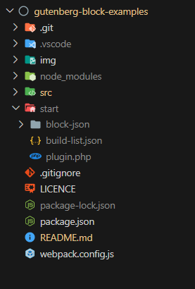

# Gutenberg Block Examples

This repository contains a series of examples to demonstrate various aspects of coding Gutenberg blocks.

There is an alphabetical list of the examples in [`src/build-list.json`](./src/build-list.json).

[internal link](#development-environment-wordpress-recommended-way)

## Using these examples

The example files, which are written in [JSX/](https://react.dev/learn/writing-markup-with-jsx), are in the `src` folder. When using the examples, they are transpiled into a WordPress plugin, located in the `start/`.

Running these examples on your computer requires a development environment, so that, a WordPress test site can be locally hosted.

### Development environment: WordPress' recommended way

Using these examples requires WordPress' development environment:

- Node.js--needed for everything else to run.

- [`@wordpress/env`](https://developer.wordpress.org/block-editor/reference-guides/packages/packages-env/)--needed to get a locally hosted test site running on you computer.

  - Requires Docker (installed separately)

- [`@wordpress/scripts`](https://developer.wordpress.org/block-editor/reference-guides/packages/packages-scripts/)--needed to build (transpile) the examples into a WordPress plugin.

  - Requires Webpack (installed automatically when `@wordpress/scripts` is installed)

WordPress' quick start guide can be found in the [Gutenberg Handbook](https://developer.wordpress.org/block-editor/getting-started/devenv/#quick-start).

**When `wp-scripts` is started, the examples are built into a WP plugin, located in a folder named `start`, which is placed into the root folder.**

Using this environment, when the source code is changed and saved, the plugin within the `start` folder will automatically be updated.

Other methods of running a WP test site can be use. However, the you must be able to copy the `start` folder to `wp-content/plugins/`. Using code editors, such as VS Code, it is also possible to connect the `start` folder to a remotely hosted WP site via an FPT/SFTP plugin.

### Clone this repository and install the examples

Once the development environment is up and running, the examples can be installed .

[Clone this repository](https://docs.github.com/en/repositories/creating-and-managing-repositories/cloning-a-repository) into the folder you wish to work from on your computer@#[]. For example, `gutenberg-block-examples`.

In the terminal, from the examples' root folder, enter:

```
~/gutenberg-block-examples$ npm install
```

This will create a `node_modules` folder, and install all the npm dependencies listed in the `package.json` file.

### Building the test plugin

With a WP site running in `wp-env`:

1. Open `src/build-list.json`.

2. On the examples you want to test, set `include` to `true`.

3. In the terminal, from the root folder, enter:

```
~/gutenberg-block-examples/$ npm run start
```

`wp-scripts` will now create the `start` folder, and the plugin files will be placed into it. The examples should now be available in the test site.



*The folder structure after build process has started.*  
*The plugin is in the `start` folder.*

**Each time you wish to change which examples are included in the plugin, you must stop `wp-scripts` (ctrl + c in the terminal where scripts is running), edit `src/build-list.json`, and restart `wp-scripts`.**

## File naming

When working on multiple examples at once, it is confusing to have several files open in the code editor, all called `index.js` etc. To avoid this, in the `src` folder, most files are prefaced with the name of the example. When the examples are built to the `start` folder, all of the JS files are transpiled to `start/example-name/index.js`; other are copied to `start/example-name/`, and some are renamed.

### The filename scheme for examples

**Example files**

- All JS files are transpiled from the `src/example-name/` folder, to `start/example-name/index.js`

- `src/example-name/example-name.php` copied & renamed to `start/example-name/index.php`

- `src/example-name/example-name.block.json` copied & renamed to `start/example-name/block.json`

- `src/example-name/example-name.style.css` copied & renamed to `start/example-name/style.css`

- `src/example-name/example-name.style.scss` transpiled to `start/example-name/style.css`

- `src/example-name/extra-block.block.json` copied to `src/example-name/extra-block.block.json` †

† Some examples build more than one block. In which case, the primary block's JSON file becomes `block.json`, and the secondary block's JSON filename remains unchanged. Try the `block-json` example to see this in action.

**Plugin files**

- `scr/plugin.php` copied to `start/plugin,php`

- `src/build-list.json` copied to `src/build-list.json`††

††Note, `build-list.json` is needed for the serverside code, as well as the Webpack build process.

The build process also adds the following files to each example in the root of the `start` folder:

- `index.assets.php`--contains the WP `@wordpress` dependencies for the example. The dependencies are generated from the `import` statements of `@wordpress` packages in the example's JS source files. †††

- `style.css.map`--allows Devtools to quote filenames and line numbers in the source style code (`css`, or `scss`), rather than the transpiled code.

- `index.js.map`--allows Devtools to quote filenames and line numbers in the source JS code, rather than the transpiled code.

††† Note, normally Webpack will include the code for the dependencies into the transpiled file. However, Webpack can be instructed that certain packages will be available in the JS environment (in this case the Gutenberg editor, in a WordPress website), and don't need to be included. These packages are called "externals". `@wordpress/scripts` includes all `@wordpress` packages, and several other 3rd party packages as externals. See the documentation on [GitHub](https://github.com/WordPress/gutenberg/blob/trunk/packages/dependency-extraction-webpack-plugin/README.md#webpack) for more details.

